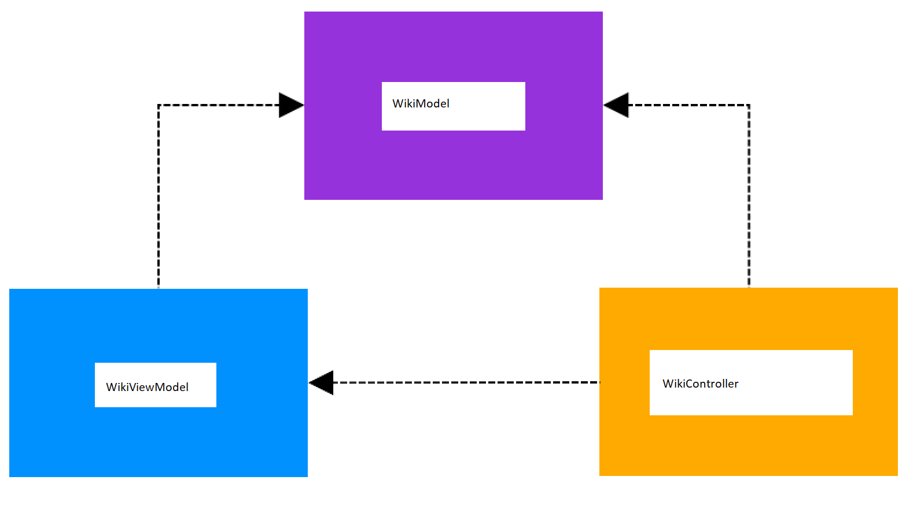

= CSCI C490 Design Document Requirements

You will create a document to describe the particular Android project you wish to complete for this course.

. Create a new Markdown or Asciidoctor document to replace this readme document.
. Format your document with proper headings, sections, paragraphs, etc.
. Your document should include descriptions of the rest of this document in copmelete and professional prose.

== Section 1 – Motivation for Your App

In this section, describe the motivation behind your choice of app to design and implement. Also indicate who is the target user base. Include references to existing apps that are similar to the app you are proposing – references must include the name of the app, the platform (e.g., iOS, Android, Windows, MacOS, etc.), and a link to a website describing the app.

I would like to create an app that shows you a random page from wikipedia, that changes each day. There are other out there that do the same thing but I think it would be an interesting project to try and replicate. Here is a place that it has been done before by wikipedia themselves:

. https://www.engadget.com/2014/06/25/new-wikipedia-app-android/ This is the wikipedia's app for android. I'd like to give it a more modern look.

The target could be anyone interested in a collective random knowledge source, being used as a "news article." i.e. just enough information to entertain but not to bore.

== Section 2 - Meeting Minimum Requirements

=== 2.1 User Interface
There will be two main pages in this application. The first one where it pulls the new days wikipedia information via wikipedia API. The second page will store a list of "favorited" links to the wikipedia page, where they will either pull up the text of the favorited link in the application, or pull up their phones default browser. The article will be read in portrait mode, and the favorites page will be accessed in landscape mode.

Here is a diagram:

=== 2.2 Data Persistence
Favorites will be kept in SQLLite databased, with links stored as values.

The current position of the text in portrait mode will be saved via TextView with the scrolling boolean enabled. On destroy or on stop, the x y coordinates of that scroll will be saved. On start or create those x y coordinates will be restored via the smoothScroll functionality. 

=== 2.3 Communication

The application will be "contacting the outside world" via Wikipedias API. In the event that the application doesnt have internet the reading/daily reading functionality will not work. However, the user will still be able to save a previous day's reading as a favorite, assuming it was pulled when there was internet access. 

== Section 3 – MVC Breakdown of Your App

=== 3.1 View Descriptions

There will be two main pages in this application. The first one where it pulls the new days wikipedia information via wikipedia API. The second page will store a list of "favorited" links to the wikipedia page, where they will either pull up the text of the favorited link in the application, or pull up their phones default browser. The article will be read in portrait mode, and the favorites page will be accessed in landscape mode.

The user can favorite a daily read via the star Button in the top right corner. A user can unfavorite their past daily reads in the landscape mode. The back button would also shift the phone back to portrait mode, or landscape mode.

At the moment the layout xml has not been created.

=== 3.2 Model Descriptions

The data that needs to be stored is the references to the wiki, and the x y position of the text on the page.

The app will be using a SQLite database stored internally. There will be one table. FAVORITE_LINKS

=== 3.3 Controller Descriptions

Start off with a high-level description of each controller and what screen it controls. Then include which Life Cycle methods are overridden by the controller. This part of the description will almost certainly have to include as a minimum how onCreate is implemented. Describe how and when the controller saves off data into the model, and how and when it retrieves data from the model.

You must describe how your app will satisfy the data persistence requirement in the controller descriptions and/or the model descriptions. If the model is designed so that it always keeps the persistent data store up-to-date, then the model description will more than likely discuss persistence. If the controller is implemented to update the persistent data store at some specific time of the app’s life cycle, then the controller’s description will more than likely discuss persistence. The discussion might need to appear in both the model and the controller descriptions.
